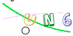

# easy-captcha

## example




## Install

To use easy-captcha in your Go project, you can import it using the following command:

```shell
 go get github.com/wwwwwbr/easy-captcha
```

## Usage

To use the timezone conversion functions, first import this package:

```go
import (
    easyCaptcha "github.com/wwwwwbr/easy-captcha"
)
```
Then, call the function
```go
captcha := easyCaptcha.NewGifCaptcha(120, 60, 4)
_ = captcha.SaveFile(GifPath)

text := captcha.Text()
fmt.Println(text)

base64, _ := captcha.Base64()
fmt.Println(base64)
	
```